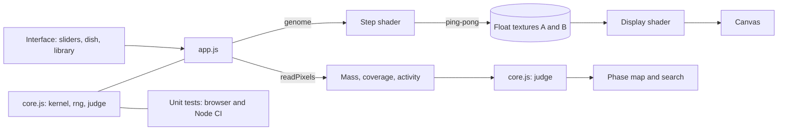

# Architecture

Anima is a static site. All computation happens in the visitor's browser, mostly on the GPU.

## Simulation

State is stored in two RGBA32F textures that swap roles each step. The red channel holds the cell value, green holds the
change made this step (used for colouring and for the activity metric), and blue holds the neighbourhood potential.
A fragment shader reads a ring-shaped neighbourhood with `texelFetch`, wraps at the edges, applies the growth function
and writes the next state. Float textures need `EXT_color_buffer_float`. If it is missing the page shows a clear message.

## Kernel

The kernel radius is split evenly between the rings in use (one to three). Within a ring the weight follows
`exp(4 − 1/(r(1−r)))`. The sum of the kernel is computed on the CPU by the same formula and passed to the shader so that
the neighbourhood average is normalised. `core.js` holds that formula and the tests check it.

## Search

A trial reseeds the dish with a fixed seed, runs 300 steps, and reads back statistics at step 150 and step 300.
`judge()` turns them into a class and a score. Survey evaluates a grid of growth centre and width. Discover mutates the
current genome, evaluates six children per generation, and keeps the best.

## Why the core is a separate file

`core.js` has no DOM or WebGL code. The same file is loaded by the browser, by `tests/index.html` and by the Node runner in CI,
which keeps the logic that decides results easy to test.

## Deployment

The GitHub Actions workflow runs the tests on every push and pull request. Only a passing `main` build is published to Pages.
